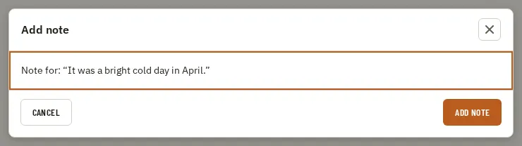

# Dialog

Storybook title: `Primitives/Dialog`. Source: `src/components/primitives/Dialog.tsx`.

## Stories

- Actions Between
- Actions End
- Actions Between With Group
- Without Close Button
- Long Unbroken Token
- Long Scrolling Content
- Close Button Invokes On Close

## Used by

- `src/components/manuscript/AddNoteDialog.tsx`
- `src/components/primitives/ConfirmDialog.tsx`
- `src/components/primitives/WorkDialog.tsx`
