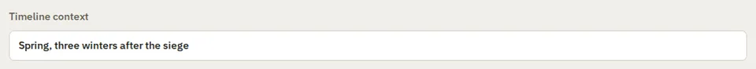

# Field

Storybook title: `Primitives/Field`. Source: `src/components/primitives/Field.tsx`.

## Stories

- Text Input
- Text Input Empty
- With Placeholder
- Text Input Long Value
- Textarea
- Textarea Empty
- Textarea Multiline
- Text Input Disabled
- Secret Input
- Textarea Disabled
- Typing Updates Value
- Clearing Reports Empty String
- Textarea Typing Keeps Newlines
- Blur Commits Draft
- Disabled Is Inert
- Textarea Disabled Is Inert
- With Hint
- With Error
- Textarea With Hint And Error
- Focused On Mount

## Used by

- `src/components/booth/BoothPage.tsx`
- `src/components/booth/BuiltinRecorder.tsx`
- `src/components/booth/MicrophoneField.tsx`
- `src/components/credits/CreditsSetupDialog.tsx`
- `src/components/engine/ChapterTagsDialog.tsx`
- `src/components/engine/RenderConfigDialog.tsx`
- `src/components/manuscript/AddNoteDialog.tsx`
- `src/components/manuscript/MarkupDialog.tsx`
- `src/components/manuscript/WordLookup.tsx`
- `src/components/production/ImportReview.tsx`
- `src/components/production/PlanPanel.tsx`
- `src/components/project/NewProjectDialog.tsx`
- `src/components/proof/FindingDetail.tsx`
- `src/components/proof/FlagsPanel.tsx`
- `src/components/proof/TakeReviewReads.tsx`
- `src/components/proof/TakeReviewScanDialog.tsx`
- `src/components/settings/CreditsPanel.tsx`
- `src/components/settings/DeliveryProfileEditor.tsx`
- `src/components/settings/OnlineDictionaryPanel.tsx`
- `src/components/storybible/GuideDetail.tsx`
- `src/components/storybible/PronunciationWork.tsx`
