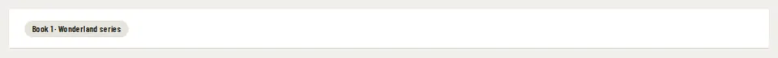

# HeaderChip

Storybook title: `Primitives/HeaderChip`. Source: `src/components/primitives/HeaderChip.tsx`.

## Stories

- Neutral
- Success
- Warning
- Quiet Dot
- Timer
- Opens The Panel
- Measured Header

## Used by

- `src/components/booth/BuiltinRecorder.tsx`
- `src/components/layout/EngineChip.tsx`
- `src/components/layout/TimerChip.tsx`
