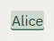

# Highlight

Storybook title: `Primitives/Highlight`. Source: `src/components/primitives/Highlight.tsx`.

## Stories

- Character
- Place
- Organization
- Lore
- Item
- Event
- Review
- Note
- Cursor
- In Running Text
- Interactive
- Click Activates
- Keyboard Activates
- Static Is Not A Button

## Used by

- `src/components/manuscript/ChapterNav.tsx`
- `src/components/manuscript/EntitySummary.tsx`
- `src/components/manuscript/ParagraphView.tsx`
- `src/components/settings/CreditsPanel.tsx`
- `src/components/storybible/GuideDetail.tsx`
- `src/components/teleprompter/ReaderText.tsx`
