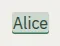

# Highlight

Storybook title: `Primitives/Highlight`. Source: `src/components/primitives/Highlight.tsx`.

## Stories

- Character
- Place
- Organization
- Lore
- Item
- Event
- Review
- Note
- Cursor
- Misread
- Extra
- Skipped
- Restart
- Flags In Running Text
- In Running Text
- Interactive
- Click Activates
- Keyboard Activates
- Static Is Not A Button
- Per Speaker Colour

## Used by

- `src/components/booth/BoothView.tsx`
- `src/components/booth/ReaderKey.tsx`
- `src/components/booth/ReaderText.tsx`
- `src/components/manuscript/ChapterNav.tsx`
- `src/components/manuscript/EntitySummary.tsx`
- `src/components/manuscript/ParagraphView.tsx`
- `src/components/settings/CreditsPanel.tsx`
- `src/components/storybible/GuideDetail.tsx`
