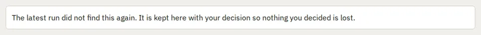

# InsetCard

Storybook title: `Primitives/InsetCard`. Source: `src/components/primitives/InsetCard.tsx`.

## Stories

- Default
- Filled
- Dashed
- Tones
- List In A Panel
- Named Section

## Used by

- `src/components/booth/ResumePrompt.tsx`
- `src/components/editing/EditingCandidateRow.tsx`
- `src/components/editing/EditingCheckPanel.tsx`
- `src/components/engine/ChapterSyncPanel.tsx`
- `src/components/layout/StartupScreen.tsx`
- `src/components/production/ChapterTrackPanel.tsx`
- `src/components/production/PickupListCount.tsx`
- `src/components/production/RecordingCheck.tsx`
- `src/components/production/RecordingCheckReport.tsx`
- `src/components/production/RemovedFromRecordingList.tsx`
- `src/components/production/TakeReviewPickups.tsx`
- `src/components/proof/AuditionDialog.tsx`
- `src/components/proof/InlineDiff.tsx`
- `src/components/proof/PreviewPanel.tsx`
- `src/components/proof/TakeComparisonView.tsx`
- `src/components/proof/TakeReviewReads.tsx`
- `src/components/series/SeriesTab.tsx`
- `src/components/settings/KeyboardPanel.tsx`
- `src/components/settings/OnlineDictionaryPanel.tsx`
- `src/components/stages/StageEvidence.tsx`
- `src/components/storybible/DialogueCueAttribution.tsx`
- `src/components/storybible/PronunciationWork.tsx`
- `src/components/storybible/VoiceReferencesSection.tsx`
