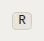

# Kbd

Storybook title: `Primitives/Kbd`. Source: `src/components/primitives/Kbd.tsx`.

## Stories

- Single Key
- Chord
- Three Key Chord
- Symbol With Spoken Label
- Chord With Symbol And Spoken Label
- Companion Size
- Booth Size
- Booth Toolbar Row
- Is Named By Its Keys
- Chord Is Named By Every Key
- Spoken Label Overrides The Glyph Name

## Used by

- `src/components/booth/BoothView.tsx`
- `src/components/booth/CompanionShell.tsx`
- `src/components/engine/RenderConfigDialog.tsx`
- `src/components/help/ShortcutSheet.tsx`
- `src/components/primitives/KeyHint.tsx`
- `src/components/settings/KeyboardPanel.tsx`
