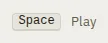

# KeyHint

Storybook title: `Primitives/KeyHint`. Source: `src/components/primitives/KeyHint.tsx`.

## Stories

- Default
- Booth Size
- Symbol With Spoken Label
- Command Bar Row
- Is Named By Its Keys And Shows The Action
- Spoken Label Overrides The Caps Name

## Used by

- `src/components/booth/ReadingControlBar.tsx`
