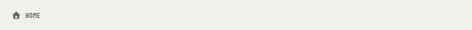

# NavButton

Storybook title: `Primitives/NavButton`. Source: `src/components/primitives/NavButton.tsx`.

## Stories

- Inactive
- Active
- Disabled
- Icon Only
- Sidebar
- Icon Rail
- Click Invokes Handler
- Active Marks Current Page
- Inactive Is Not Current
- Disabled Is Inert
- Icon Only Shows Label On Focus

## Used by

- `src/components/layout/AppShell.tsx`
