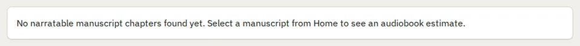

# Panel

Storybook title: `Primitives/Panel`. Source: `src/components/primitives/Panel.tsx`.

## Stories

- Text Only
- Title And Description
- Long Title Wraps
- With Header And Actions
- With Header No Actions
- With Form Fields
- Long Content
- Matches The Mock
- Header With Actions
- Flush Table
- Flush Table Under Text
- Labelled Without Title
- Leading And Rich Subtitle
- Review Tone
- Scrolling Body
- Header On Its Own
- Caps Title

## Used by

- `src/components/booth/BoothPage.tsx`
- `src/components/booth/BuiltinRecorder.tsx`
- `src/components/booth/ReadAlongView.tsx`
- `src/components/credits/CreditsSetupBanner.tsx`
- `src/components/engine/ChapterLinksTable.tsx`
- `src/components/engine/ChapterSyncPanel.tsx`
- `src/components/engine/EnginePanel.tsx`
- `src/components/layout/LoadError.tsx`
- `src/components/layout/StartupScreen.tsx`
- `src/components/master/DeliveryPackagePanel.tsx`
- `src/components/master/DeliveryProfilePanel.tsx`
- `src/components/master/DiagnosticsSection.tsx`
- `src/components/master/FileRulesPanel.tsx`
- `src/components/master/MasterQcPage.tsx`
- `src/components/master/MasterToSpecPanel.tsx`
- `src/components/master/MasteringChain.tsx`
- `src/components/master/MultiPlatformExportPanel.tsx`
- `src/components/master/ReportExportPanel.tsx`
- `src/components/master/WhyItFails.tsx`
- `src/components/pickups/PickupsPage.tsx`
- `src/components/production/ChapterBoard.tsx`
- `src/components/production/PlanPanel.tsx`
- `src/components/production/ProductionPage.tsx`
- `src/components/production/RemovedFromRecordingList.tsx`
- `src/components/project/ProjectPicker.tsx`
- `src/components/proof/CompareRun.tsx`
- `src/components/proof/FindingDetail.tsx`
- `src/components/proof/FlagsPanel.tsx`
- `src/components/proof/NativeTakesPanel.tsx`
- `src/components/proof/NotesHeader.tsx`
- `src/components/proof/PreviewPanel.tsx`
- `src/components/proof/ProofChapterPage.tsx`
- `src/components/proof/ProofPage.tsx`
- `src/components/proof/ProofingStagePanel.tsx`
- `src/components/proof/RecordingCheckCard.tsx`
- `src/components/proof/ScriptView.tsx`
- `src/components/proof/TransportBar.tsx`
- `src/components/settings/Settings.tsx`
- `src/components/storybible/Guide.tsx`
- `src/components/storybible/GuideDetail.tsx`
