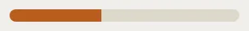

# ProgressBar

Storybook title: `Primitives/ProgressBar`. Source: `src/components/primitives/ProgressBar.tsx`.

## Stories

- Determinate
- With Value Text
- Indeterminate
- Just Begun
- Done
- Thin
- Thin Warn

## Used by

- `src/components/assets/LocalAssetRow.tsx`
- `src/components/editing/EditingCheckPanel.tsx`
- `src/components/master/DeliveryPackagePanel.tsx`
- `src/components/master/DiagnosticsSection.tsx`
- `src/components/master/MasterQcPage.tsx`
- `src/components/master/MasterToSpecPanel.tsx`
- `src/components/master/MultiPlatformExportPanel.tsx`
- `src/components/primitives/StatTile.tsx`
- `src/components/primitives/WorkDialog.tsx`
- `src/components/proof/CompareRun.tsx`
