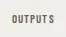

# SectionLabel

Storybook title: `Primitives/SectionLabel`. Source: `src/components/primitives/SectionLabel.tsx`.

## Stories

- Default
- In A Card
- As Legend
- Long Label Wraps

## Used by

- `src/components/booth/BuiltinRecorder.tsx`
- `src/components/booth/ReaderFlagsPanel.tsx`
- `src/components/engine/ChapterSyncConsentDialog.tsx`
- `src/components/engine/ChapterSyncPanel.tsx`
- `src/components/engine/EnginePanel.tsx`
- `src/components/manuscript/MarkupDialog.tsx`
- `src/components/manuscript/ReaderCard.tsx`
- `src/components/master/DeliveryPackagePanel.tsx`
- `src/components/master/MultiPlatformExportPanel.tsx`
- `src/components/pickups/PickupsCompanionSummary.tsx`
- `src/components/pickups/PickupsPage.tsx`
- `src/components/primitives/StatTile.tsx`
- `src/components/primitives/WorkDialog.tsx`
- `src/components/production/ChapterTrackPanel.tsx`
- `src/components/production/ImportReview.tsx`
- `src/components/production/RecordingCheckReport.tsx`
- `src/components/project/ProjectPicker.tsx`
- `src/components/proof/CompareRun.tsx`
- `src/components/proof/FlagsPanel.tsx`
- `src/components/proof/InlineDiff.tsx`
- `src/components/proof/NativeTakesPanel.tsx`
- `src/components/proof/ProofChapterPage.tsx`
- `src/components/proof/ScriptView.tsx`
- `src/components/settings/KeyboardPanel.tsx`
