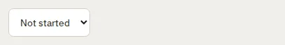

# Select

Storybook title: `Primitives/Select`. Source: `src/components/primitives/Select.tsx`.

## Stories

- Default
- Full Width
- Disabled
- With Placeholder Option
- Choosing Reports The Value
- Keyboard Reaches It

## Used by

- `src/components/home/AudiobookEstimatePanel.tsx`
- `src/components/home/ImportReview.tsx`
- `src/components/mapping/MappingConfirm.tsx`
- `src/components/review/AuditionDialog.tsx`
- `src/components/review/ReviewFilters.tsx`
- `src/components/review/TakeReviewReads.tsx`
- `src/components/review/TakeReviewScanDialog.tsx`
- `src/components/settings/CreditsPanel.tsx`
- `src/components/settings/DeliveryProfilesPanel.tsx`
- `src/components/settings/RetailSamplePanel.tsx`
- `src/components/settings/ScopedSetting.tsx`
- `src/components/storybible/GuideDetail.tsx`
- `src/components/teleprompter/MicrophoneField.tsx`
- `src/components/teleprompter/TeleprompterPage.tsx`
- `src/components/tracks/LinkChaptersDialog.tsx`
