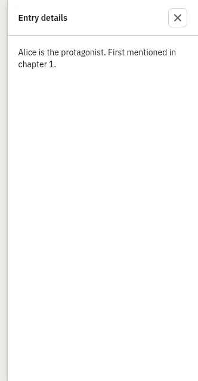

# SlideOver

Storybook title: `Primitives/SlideOver`. Source: `src/components/primitives/SlideOver.tsx`.

## Stories

- Open
- Closed
- Long Content
- Wide
- Custom Close Label
- Close Button Invokes On Close
- Backdrop Click Invokes On Close
- Escape Invokes On Close
- Keeps Focus Inside And Hides The Page
- Returns Focus To The Opener

## Used by

- `src/components/editing/EditingCheckPanel.tsx`
- `src/components/engine/EnginePanel.tsx`
- `src/components/production/ChapterTrackPanel.tsx`
- `src/components/production/CreditsRowPanel.tsx`
- `src/components/production/RecordingCheck.tsx`
- `src/components/production/StatusReportPanel.tsx`
- `src/components/script/ScriptPage.tsx`
- `src/components/stages/StageEvidence.tsx`
- `src/components/storybible/GuideDetail.tsx`
- `src/components/storybible/PronunciationQueries.tsx`
- `src/components/storybible/VoiceDataPanel.tsx`
