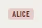

# SpeakerTag

Storybook title: `Primitives/SpeakerTag`. Source: `src/components/primitives/SpeakerTag.tsx`.

## Stories

- Default
- A Cast
- Booth Size
- Script Size
- Interactive
- Click Activates
- Keyboard Activates
- Static Is Not A Button

## Used by

- `src/components/booth/ReaderText.tsx`
- `src/components/manuscript/ParagraphView.tsx`
