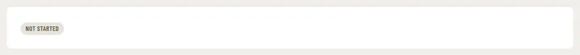

# StatusBadge

Storybook title: `Primitives/StatusBadge`. Source: `src/components/primitives/StatusBadge.tsx`.

## Stories

- Neutral
- Info
- Progress
- Success
- Warning
- Danger
- Experimental
- With Icon
- Dot
- All Tones As Dots
- Booth
- Announces Its Label

## Used by

- `src/chapterStatus.ts`
- `src/components/primitives/CapabilityGate.tsx`
- `src/components/primitives/StageGrid.tsx`
