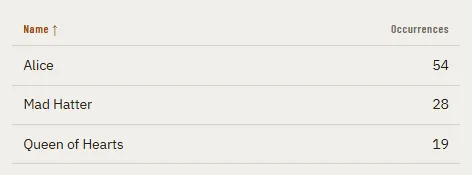

# Table

Storybook title: `Primitives/Table`. Source: `src/components/primitives/Table.tsx`.

## Stories

- Sortable Rows
- Plain
- Announces The Sort
- Rows Activate From The Keyboard

## Used by

- `src/components/home/AudiobookEstimatePanel.tsx`
- `src/components/proofing/InlineDiffRow.tsx`
- `src/components/proofing/Results.tsx`
- `src/components/storybible/Guide.tsx`
- `src/components/storybible/GuideDetail.tsx`
