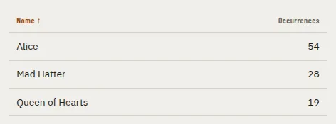

# Table

Storybook title: `Primitives/Table`. Source: `src/components/primitives/Table.tsx`.

## Stories

- Sortable Rows
- Plain
- Announces The Sort
- Rows Activate From The Keyboard
- In A Card
- Matches The Mock

## Used by

- `src/components/engine/ChapterLinksTable.tsx`
- `src/components/engine/CreateChapterRegionsDialog.tsx`
- `src/components/engine/EnginePanel.tsx`
- `src/components/engine/LinkChaptersDialog.tsx`
- `src/components/master/DeliveryProfilePanel.tsx`
- `src/components/master/DiagnosticsTables.tsx`
- `src/components/master/FileRulesPanel.tsx`
- `src/components/master/MasterToSpecPanel.tsx`
- `src/components/master/PerFileChecks.tsx`
- `src/components/production/PlanPanel.tsx`
- `src/components/production/RecordingCheckReport.tsx`
- `src/components/proof/FindingsList.tsx`
- `src/components/proof/PreviewPanel.tsx`
- `src/components/proof/TakeComparisonView.tsx`
- `src/components/script/ScriptRail.tsx`
- `src/components/settings/DeliveryProfileEditor.tsx`
- `src/components/settings/DeliveryProfilesPanel.tsx`
- `src/components/storybible/Guide.tsx`
- `src/components/storybible/GuideDetail.tsx`
- `src/components/storybible/PropertiesSection.tsx`
