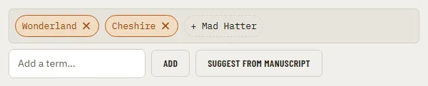

# TagInput

Storybook title: `Primitives/TagInput`. Source: `src/components/primitives/TagInput.tsx`.

## Stories

- Default
- Empty
- Only Suggestions
- Enter Adds A Term
- Add Button Adds A Term
- Blank Is Not Added
- Removing Keeps The Cursor In The Page
- Accepting A Suggestion

## Used by

- `src/components/proofing/Transcript.tsx`
