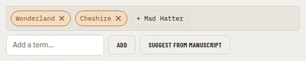

# TagInput

Storybook title: `Primitives/TagInput`. Source: `src/components/primitives/TagInput.tsx`.

## Stories

- Default
- Empty
- Only Suggestions
- Enter Adds A Term
- Comma Adds A Term
- Blur Commits The Draft
- Backspace Removes The Last Tag
- Blank Is Not Added
- Removing Keeps The Cursor In The Page
- Accepting A Suggestion

## Used by

- `src/components/proof/CompareRun.tsx`
- `src/components/settings/ScopedSetting.tsx`
