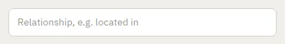

# TextField

Storybook title: `Primitives/TextField`. Source: `src/components/primitives/TextField.tsx`.

## Stories

- Empty
- Filled
- Disabled
- Monospace
- Colour Picker
- Typing Reports The Text
- Disabled Takes No Input

## Used by

- `src/components/primitives/SearchField.tsx`
- `src/components/primitives/TagInput.tsx`
- `src/components/settings/DeliveryProfileEditor.tsx`
- `src/components/settings/ScopedSetting.tsx`
- `src/components/storybible/GuideDetail.tsx`
- `src/components/storybible/PropertiesSection.tsx`
