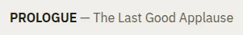

# TitleSubtitle

Storybook title: `Primitives/TitleSubtitle`. Source: `src/components/primitives/TitleSubtitle.tsx`.

## Stories

- Inline
- Inline No Subtitle
- Source Caps
- Stacked
- Truncated
- Inside Uppercase Button
- Long Unbroken Subtitle
- Renders Both Parts

## Used by

- nothing outside its own stories and tests yet
