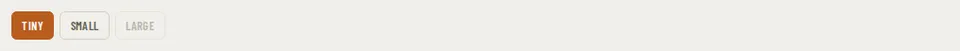

# ToggleGroup

Storybook title: `Primitives/ToggleGroup`. Source: `src/components/primitives/ToggleGroup.tsx`.

## Stories

- Default
- Second Chosen
- Choosing Moves The Press
- Disabled Chip Is Not Chosen

## Used by

- `src/components/manuscript/Manuscript.tsx`
- `src/components/proofing/Transcript.tsx`
- `src/components/settings/Settings.tsx`
- `src/components/teleprompter/ReadAlongView.tsx`
