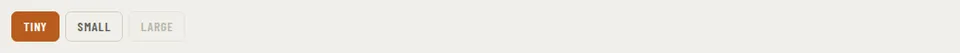

# ToggleGroup

Storybook title: `Primitives/ToggleGroup`. Source: `src/components/primitives/ToggleGroup.tsx`.

## Stories

- Default
- Second Chosen
- Choosing Moves The Press
- Disabled Chip Is Not Chosen
- Segmented
- Segmented Measured Shapes

## Used by

- `src/components/booth/BuiltinRecorder.tsx`
- `src/components/booth/ReadingControlBar.tsx`
- `src/components/editing/EditingCheckPanel.tsx`
- `src/components/master/DiagnosticsSection.tsx`
- `src/components/master/MasterQcPage.tsx`
- `src/components/proof/CompareRun.tsx`
- `src/components/script/ScriptPage.tsx`
- `src/components/settings/Settings.tsx`
