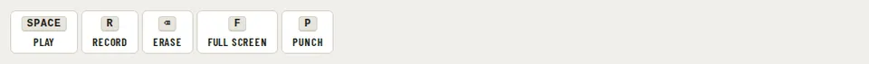

# Toolbar

Storybook title: `Primitives/Toolbar`. Source: `src/components/primitives/Toolbar.tsx`.

## Stories

- Booth Command Bar
- With An Icon Only Button
- Vertical Rail
- With A Disabled Command
- Arrows Home And End Move Focus
- Is Named As A Toolbar

## Used by

- nothing outside its own stories and tests yet
