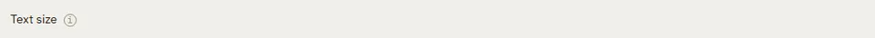

# Tooltip

Storybook title: `Primitives/Tooltip`. Source: `src/components/primitives/Tooltip.tsx`.

## Stories

- Info Icon
- Info Icon Shows Tooltip On Keyboard Focus
- Info Icon Keeps Open On Enter After Focus
- Info Icon Lets Tab Move On
- Info Icon Toggles On Press
- Info Icon Popup Takes Pointer Events
- On Button
- Shows Tooltip On Focus
- Escape Hides Tooltip
- Hides Tooltip On Blur
- On Disabled Button
- Disabled Button Explains Why On Focus
- Inline In Running Text

## Used by

- `.storybook/preview.tsx`
- `src/App.tsx`
- `src/components/home/AudiobookEstimatePanel.tsx`
- `src/components/home/Home.tsx`
- `src/components/home/ImportReview.tsx`
- `src/components/layout/AppShell.tsx`
- `src/components/manuscript/EntitySummary.tsx`
- `src/components/manuscript/Manuscript.tsx`
- `src/components/manuscript/ReaderCard.tsx`
- `src/components/primitives/MeterBar.tsx`
- `src/components/primitives/NavButton.tsx`
- `src/components/primitives/Pill.tsx`
- `src/components/primitives/SearchField.tsx`
- `src/components/primitives/Table.tsx`
- `src/components/primitives/TagInput.tsx`
- `src/components/primitives/TitleSubtitle.tsx`
- `src/components/proofing/Results.tsx`
- `src/components/proofing/Transcript.tsx`
- `src/components/review/FindingDetail.tsx`
- `src/components/review/ReaperControls.tsx`
- `src/components/review/TakeComparisonView.tsx`
- `src/components/review/TakeReviewReads.tsx`
- `src/components/settings/ScopedSetting.tsx`
- `src/components/storybible/Guide.tsx`
- `src/components/storybible/GuideDetail.tsx`
- `src/components/storybible/PropertiesSection.tsx`
- `src/components/teleprompter/ReaderFlagsPanel.tsx`
- `src/components/teleprompter/ReaderRail.tsx`
- `src/components/teleprompter/ReaderText.tsx`
- `src/components/teleprompter/ReadingControlBar.tsx`
