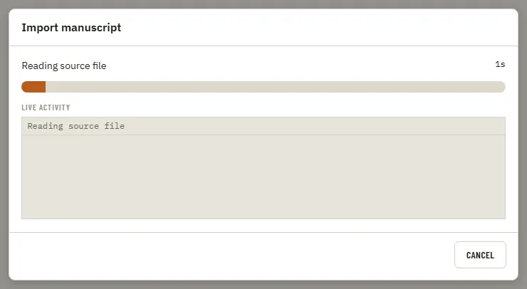

# WorkDialog

Storybook title: `Primitives/WorkDialog`. Source: `src/components/primitives/WorkDialog.tsx`.

## Stories

- Preparing
- Running Indeterminate
- Running With Progress
- Download With Bytes
- Committing
- Running Without Cancel
- Running In Background
- Success
- Error State
- Cancelled
- Long Logs
- Cancel Invokes Cancel
- Escape Is Ignored While Running
- Close Invokes Close When Finished
- Escape Closes When Finished

## Used by

- `src/components/assets/AssetInstallPrompt.tsx`
- `src/components/home/Home.tsx`
- `src/components/settings/UpdateDownloadDialog.tsx`
- `src/components/settings/UpdatesPanel.tsx`
- `src/components/storybible/Guide.tsx`
