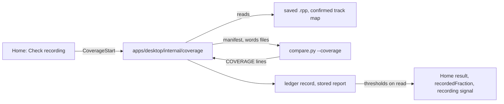

# Recording Check (recording coverage)

**Status: Implemented.** The Home check, the stored result, the measured recorded length and the `recording` stage
signal all work. The four settings ship with values chosen on synthetic fixtures and are labelled uncalibrated on real
narration ([ADR 0132](../adr/0132-the-recording-check-ships-0-8-3-8-3-chosen-on-synthetic-fixtures-and-labelled-uncalibrated.md)).

## User problem

A chapter is recorded when all of its text is on the track, in order, even with mistakes. Before this check the app
could not say whether that was true. Transcript Compare finds mistakes inside what was read, and by design ignores what
was never read. The Home breakdown guessed the recorded length from the chapter's status. So a narrator decided "done
recording" from memory. The cost of a wrong call is an editing pass started on a chapter with a hole in it.

## Workflow

Save the REAPER project, then press **Check** on a chapter's row of the Home breakdown and **Check recording**. The
check reads the chapter's confirmed REAPER track from the saved project file. It transcribes each item's played range
that it has not transcribed before, and then aligns the chapter's text to the words in order. The result reads "Text
present: N of M words" and lists each missing region: which paragraphs, how many words, the first and last missing
words, and where the gap sits in the audio. When every paragraph passes the
two thresholds, the chapter's `recording` signal is `met`, and the stage recommendations can suggest moving it on. The
narrator always confirms. See [Using the app: Home](../guides/using-the-app/home.md#checking-a-chapters-recording) for
the screens and [Settings](../guides/using-the-app/settings.md) for the four numbers.

Each chapter's status is also known without a click. Chapter sync's `chaptersync:state` event
([DAW chapter-track auto-sync](../prds/daw-chapter-track-auto-sync.prd.md) Phase 6) carries one row per narration
chapter: its track, whether its check is `current`, `stale` (with the reasons above) or `never` run, when the check
finished, whether one is running, and when the track last changed. The row is this evaluation of the stored result
against the saved project, so reading it still never starts a check (Q14). The event is sent after each sync, each
save the watcher picks up, and each check that ends.

A chapter whose recording changed since its check is also re-checked in the background
([ADR 0211](../adr/0211-a-changed-chapter-is-rechecked-in-the-background-only-on-mains-power-with-reaper-quiet-and-not-recording.md)):
one at a time, the oldest change first, and only when the setting **Check changed chapters in the background** is on,
no other job runs, the Whisper model is installed, the computer is on mains power, REAPER is closed (until the bridge
says whether it is recording), and nothing has changed for three minutes. It is the same check as a press, labelled
background, and pressing **Check recording** pre-empts it. `chaptersync:state`'s `background.wait` says why none runs.

## How it works

- **The manifest comes from the saved project, not from REAPER.** `apps/desktop/internal/coverage` reads the `.rpp`
  the Tracks page selected, the chapter's one confirmed track (`chapter-track-map.json`, analysis evidence ledger), and
  each item's active take and played range, `[SOFFS, SOFFS + LENGTH × PLAYRATE]`, in position order. Muted items are
  listed and skipped. A chapter that cannot be checked gets a typed reason and nothing runs: not linked, several
  tracks, the linked track missing, a missing or non-audio source, an empty range, not a narration chapter, or no
  project file ([ADR 0128](../adr/0128-the-coverage-service-reads-the-saved-project-keeps-words-per-source-range-and-leaves-model-and-language-out-of-the-parameter-hash.md)).
- **Words are kept per source range.** The sidecar keeps one words file per item. The host moves them between the
  run's `--words-dir` and the evidence cache (`narration-utils/analysis/cache/`). The cache is keyed by source identity,
  model, language and hints, so a trim that narrows a range reuses the words and only a changed item is transcribed
  again ([ADR 0127](../adr/0127-the-coverage-sidecar-mode-reads-a-json-manifest-keeps-one-words-file-per-item-and-writes-tagged-json-lines.md)).
- **The alignment is the take markers' own.** `core/recording_coverage.py` reads the `SequenceMatcher` opcodes that
  `diff_and_build_markers` computes, so coverage and the markers cannot disagree. The marker output is unchanged,
  pinned by a golden file. The Phase 2 spike kept `SequenceMatcher` over a word-level DP
  ([ADR 0126](../adr/0126-recording-coverage-reads-the-take-markers-sequencematcher-alignment-and-folds-chance-matches-into-gaps.md),
  [the spike](../research/recording-coverage-alignment-spike.md)).
- **The sidecar measures, the host judges.** `compare.py --coverage` writes counts only: `COVERAGE`, `COVERAGE_ITEM`,
  `COVERAGE_PARAGRAPH` and `COVERAGE_REGION` lines, each with a JSON payload. A region names its kind, paragraphs,
  word count and first and last words, and three points in the audio, each `{itemIndex, itemGuid, sourceTime}` in
  source seconds: `position`, where the missing text would sit; `before`, the end of the last matched word before it;
  and `after`, the start of the first matched word after it. A read title never bounds a region, so `before` is `null`
  for a head and `after` for a tail, and all three are `null` when nothing was said. A result stored before the bounds
  existed reads with none, and is still current
  ([ADR 0168](../adr/0168-a-coverage-region-carries-its-bounds-as-optional-before-and-after-points-with-no-version-bump.md)).
  After those lines comes the word alignment the edit and proof workspace reads
  ([ADR 0242](../adr/0242-the-recording-check-writes-the-chapters-word-alignment-as-additive-lines-and-align-again-never-transcribes.md)):
  - one `COVERAGE_TOKEN` per chapter token: its paragraph, the ordinal of its word in the paragraph's text, and its status,
    which is `read`, `misread`, `heading` or the region kind the check counted it as; plus the item and source seconds
    where it was heard;
  - one `COVERAGE_EXTRA` per run of heard words the chapter does not account for.

  `--align-only` re-aligns from the cached words files and never transcribes. The host does not read these lines yet
  (the stored alignment and its binding are the PRD's Phase 1 host side).
  Every run writes one ledger record
  (`complete`, `partial` on cancel, or `failed`). A complete run's report is stored under
  `narration-utils/analysis/coverage/results/` with a hash of the chapter's text. The host applies the thresholds when
  it reads a report, so a threshold change never transcribes or aligns again.
- **Progress is real and a check runs only on a press.** Progress is the seconds transcribed over the seconds to
  transcribe. Cancel keeps the finished items. One check runs at a time, and a run ends with one `job:ended` event
  ([ADR 0129](../adr/0129-the-coverage-bindings-answer-refusals-as-results-end-with-one-job-event-and-fill-recordedfraction-only-from-a-current-check.md),
  [ADR 0130](../adr/0130-the-home-recording-check-opens-on-the-stored-result-runs-only-on-a-press-and-labels-the-recorded-length-measured-or-estimated.md)).
- **A result is current, stale or never.** It goes stale when the saved project changes under it: an item added,
  removed, trimmed, moved, muted or switched to another take, or an audio file changed. It also goes stale when the
  chapter's text, the equivalences, the vocabulary hints or an alignment setting changes. A different Whisper model or
  language keeps it current and labelled with the model (Q13).
- **Three readers.** The Home dialog (`RecordingCheck.tsx`) shows the stored report. The `CoverageResult` payload also
  carries `judgement`: met or not met by the narrator's thresholds, with the gap that fails first. It comes from
  `coverage.Judge`, the same function the stage signal uses, so the two cannot disagree. It is set for any complete
  result with a report, a stale one included (as of the last check)
  ([ADR 0204](../adr/0204-the-recording-check-result-carries-the-hosts-judgement-by-the-stage-signals-rule.md)). `recordedFraction` on the chapter
  payload is the present share of a current complete check only; it no longer feeds Home's **Actual recorded** column,
  which instead reads `recordedSeconds`, a real duration from the chapter's linked track in the saved project, unrelated
  to any check ([Actual Recorded](../prds/actual-recorded-column.prd.md) Phase 3, superseding Q12 below).
  `coverage.RecordingSignal` gives the stage recommendations engine the tri-state
  `recording.text_present` signal
  ([ADR 0131](../adr/0131-the-recording-signal-is-read-from-stored-checks-with-thresholds-applied-on-read-and-alignment-from-settings.md),
  [stage recommendations](../architecture/stage-recommendations.md)).

### What counts as read

- **Body tokens** are the chapter's paragraph words after `compare.py`'s tokenizing: homophones, number words,
  equivalences and hyphen fusing all apply. The title and subtitle are optional heading tokens. They are never in the
  denominator and never extra (Q11).
- **Present.** An `equal` block of at least `min_anchor_run` tokens is read text. A shorter block counts only at either
  end of the alignment or next to another `equal` block. Elsewhere it is a chance match and joins the gap around it.
  In a gap of up to `max_misread_run` body tokens, up to as many tokens as were said count as present. That is a
  misread, and misreads count as read.
- **Missing** is everything else, including an unread head and tail (which the take markers ignore). The regions are
  `head`, `tail`, `skip` (not said, or said again as a retake), `short_read` (fewer words said than written) and
  `different_text` (a larger gap of other speech).
- **Extra** speech, such as retakes, false starts and asides, is counted and never held against the narrator. A
  paragraph read only out of place, like a pickup recorded at the end, is missing where it belongs.
- **A chapter is complete** when every paragraph has at least `min_paragraph_present` of its words present, and no run
  of missing words, counted across paragraph boundaries and including the head and tail, is longer than
  `max_missing_run`.

### Settings

The `RecordingCoverage` settings tool, layered project over global over the built-in defaults like every other tool
([ADR 0155](../adr/0155-settings-gain-a-number-kind-with-a-declared-range-and-delivery-limits-are-the-narrators-own.md)):

| Setting | Default | Kind | What it decides |
| --- | --- | --- | --- |
| `min_paragraph_present` | 0.8 | threshold, applied on read | The share of each paragraph that must be read. This sets how much transcriber error is tolerated |
| `max_missing_run` | 3 | threshold, applied on read | The longest run of missing words allowed. This is the check's resolution: a skipped phrase of 4 or more words always fails |
| `max_misread_run` | 8 | alignment, stale on change | The largest gap of words that still counts as a misread. More than this said as other text is `different_text` |
| `min_anchor_run` | 3 | alignment, stale on change | The shortest match that counts as read on its own. At 2, common word pairs inside unrelated speech count |

The Settings page labels them **Proposed values, not yet calibrated**. They were chosen by the Phase 8 calibration:
the synthetic fixtures run through the shipped path, 600 candidates, and five levels of simulated transcriber error.
The shipped values give no false "met" on the held-out cases at any level. They pass every complete chapter under
light error, where the owner's starting value of 0.95 failed 7 of 35. On Piper renders of the committed cases,
transcribed by the real sidecar with `small` and `tiny`, all 16 cases come out right. A second Piper take compared
`small` with `large-v3-turbo`: neither passed an unread chapter, `small` failed one complete chapter with a
repeated passage, and `large-v3-turbo` got all 16 right at about twice the time. `medium` was slower than
`large-v3-turbo` and no more accurate. The full tables and the time
budget (about 10 s of CPU per audio minute with `small` and about 20 s with `large-v3-turbo` on the machine measured) are in
[the calibration note](../research/recording-coverage-calibration.md).

## Decisions

The code comments name these decisions by their labels from the delivered PRD (`git log --diff-filter=D --
docs/prds/recording-coverage-analysis.prd.md` finds it).

| Label | Decision |
| --- | --- |
| D1 | Suggestions only. The check never changes a chapter's status, and the narrator confirms |
| D2 | Tri-state signal: `unknown` for never checked, stale, unmapped, partial or unavailable, and `unknown` is never `met` |
| D5 | One confirmed track per chapter. An unconfirmed name match is never used |
| D11 | `recordedFraction` is the share of the chapter's words present, from a current complete check only |
| D12 | No default ships before it has been scored on labelled chapters (amended by Q15) |
| Q1 | Word-level alignment reported per paragraph (`p-NNNNNN`), with each region's first and last words |
| Q2 | Reuse the take markers' `SequenceMatcher` alignment. The spike found no reason to move to a DP |
| Q3 | Four settings: two thresholds and two alignment parameters. Started at 0.95, 3, 8 and 3, and shipped at 0.8, 3, 8 and 3 (ADR 0132) |
| Q4 | Narration chapters only. Front Matter is not a target |
| Q5 | The active take of each item only |
| Q6 | The saved `.rpp` is the only basis. A live Transcript Compare run never feeds the signal |
| Q7 | The narrator's Transcript Compare model (`small` by default), recorded on each result |
| Q8 | The live teleprompter tracker is not reused: its "done" is a cursor position |
| Q10 | Muted items are skipped and listed |
| Q11 | A spoken title or subtitle is optional, and never counted as missing or extra |
| Q12 | *Superseded* by [Actual Recorded](../prds/actual-recorded-column.prd.md) Phase 3: an unmeasured chapter kept the status estimate, labelled "estimated from status"; the column now reads a real recorded length or a plain dash, never a guess |
| Q13 | Another model or language keeps a result current (labelled). Another alignment setting makes it stale |
| Q14 | On demand only: Home reads stored results and never starts a check. Superseded in part by [ADR 0211](../adr/0211-a-changed-chapter-is-rechecked-in-the-background-only-on-mains-power-with-reaper-quiet-and-not-recording.md): the host re-checks a changed chapter on its own, only on mains power with REAPER quiet and not recording (`RecordingCoverage.background_checks`, on by default); reading a status still never starts one |
| Q15 | Synthetic fixtures now, with `NARRATION_COVERAGE_CORPUS` for a real permissioned corpus later ([ADR 0125](../adr/0125-recording-coverage-ground-truth-is-scripted-recordings-with-paragraph-labels-and-a-corpus-directory-variable.md)) |

## Tests and tooling

- `sidecars/transcript-compare/tests/`: `test_coverage.py` (the definitions), `test_coverage_mode.py` (the sidecar
  mode with a fake transcriber), `test_marker_golden.py` (markers unchanged), `coverage_harness.py` and
  [the fixture set](../research/recording-coverage-fixtures.md), `coverage_spike.py` (Phase 2) and
  `coverage_calibration.py` (Phase 8), each pinned by its own test file.
- `apps/desktop/internal/coverage`: service tests with a fake sidecar (fresh, all-cached, one-item edit, cancel, every
  refusal and staleness cause), the signal table, settings and a provider test through `stages.Collect`. A test runs
  the real sidecar over cached words when the checkout has a Python environment. `corpus_test.go` stores the
  sidecar's pinned output for every fixture case (`fixtures/coverage/results.golden.json`, written by
  `test_coverage_results_golden.py`) as a complete check and runs `stages.Service` over it: `editing` is suggested
  for exactly the cases labelled complete.
- UI: `RecordingCheck.test.tsx`, the wire contracts for `coverage:state` and the four bindings
  ([wire contracts](../architecture/wire-contracts.md)), the visual states `home/recording-check-*` and
  `settings/*-recording-check`, and the aria snapshot of the dialog.

## Non-goals and review boundary

The check judges presence, not performance. It never edits the project, moves audio, activates a take or changes a
status. It does not use forced alignment or any PyTorch model ([ADR 0008](../adr/0008-timing-confidence-over-forced-alignment-model-for-transcript-compare.md)),
send audio anywhere, or run in the background. It does not move a pickup back to its place, which is take review's
job. It does not use Lua or a running REAPER, and does not handle multi-track chapters. The trust boundary (the
manifest names the audio the sidecar reads and the words files it writes) is row 4e of the
[threat model](../architecture/threat-model.md).

## Not done yet

Tracked in [#425](https://github.com/countrymanprime/narration-utils/issues/425):

- **A cross-check against REAPER.** An optional, owner-run check that the standalone manifest matches the Lua
  `manifest_<run>.txt` for one chapter. It is read-only, but it needs REAPER open.
- **A real, permissioned corpus.** It would replace the synthetic calibration and drop the "uncalibrated" label.
- **Play from a region** over `/media`, a Could in the PRD.
